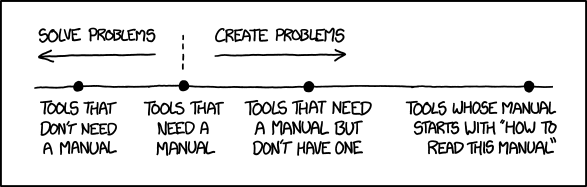
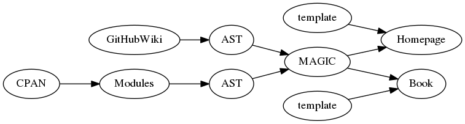

---
title: Catmandu Documentation
author: Jakob Voß
date: 2016-04-11
place: CatmanduCon 2016, Staatsbibliothek zu Berlin
institute: Verbundzentrale des GBV (VZG)
...

# Documentation?

## Documentation matters

Usability
  : or people will not try or give up the tools

Quality
  : writing good documentation is part of testing

> If it's difficult to explain easy, the design is flawed!

## Need a manual?

## Where's the Catmandu documentation?

* Module POD $\Rightarrow$ MetaCPAN, perldoc...
* Help and error messages (`catmandu help`)
* Project homepage <http://librecat.org/>
* Presentation slides, articles, handouts...
* Answers at mailing list, StackOverflow, Twitter...
* Projects that make use of Catmandu

# Audience

## Who reads our documentation?

* There is not "the user" but different user groups
* "**Personas**" help focus writing for user groups
* Good personas are based on research (surveys etc.)
* Good personas have a detailled description each

## Some possible personas

* Just another Perl hacker
* perl-agnostic programmer
* IT admin with basic copy-and-paste scripting skills
* data conversion specialist with preference for GUIs
* non-technical interested in data science & research data
* ...

## Avoid assumptions about the audience!

* general programming skills
* knowledge of Perl and/or command line fu
* English language 
* cultural background
* patience and short-term memory
* ...

# Managing Catmandu documentation
 
## Current documentation

document                                 sources
---------------------------------------- ------------------
MetaCPAN                                 POD
catmandu help                            source code & POD  
error messages                           source code
<http://librecat.org/Catmandu/>          GitHub Wiki
<http://librecat.org/distributions.html> MetaCPAN & APIs
...                                      ...
---------------------------------------- ------------------

## POD conversions

* MetaCPAN ($\rightarrow$ specific HTML)
* Catmandu::Util::pod_section ($\rightarrow$ CLI)\
  `catmandu info`\
  `catmandu help $COMMAND`\
  `catmandu help import|export|store|copy|fix $NAME`
    * NAME
    * DESCRIPTION
    * EXAMPLES
    * CONFIGURATION (list of options)
* Pod::Simple::Pandoc ($\rightarrow$ any HTML, PDF...)

## Introducing the Pandoc Abstract Syntax Tree (AST)

* [Pandoc](http://pandoc.org/) (1.16 or at least 1.12)
* [Pandoc::Elements](https://metacpan.org/release/Pandoc-Elements)
  (see its POD for details)
* `pandoc -t json < $(MARKDOWNFILE).md`^[for instance GitHub Wiki page] $\rightarrow$ AST
* `pod2pandoc $(MODULE).pm` $\rightarrow$ AST 
* `pandoc -f json ... < $(AST).json` $\rightarrow$ HTML

Example: `=head1 Foo`\
$\Rightarrow$ `Header 1, [ Str "Foo" ]`\
$\Rightarrow$ `BulletList [ Plain [ Str "Foo" ] ]`\
$\Rightarrow$ `<li>Foo</li>` (or list item in LaTeX/PDF)

## Documentation content flow

MAGIC
  : Mix & modify content from multiple documents

# Outlook

## Summary

* Writing great documentation for fun and profit
* Mind the audience
* POD content can be reused
* Combine documents with Pandoc::Elements

## Suggestions to improve Catmandu documentation

* Redesign homepage <http://librecat.org/>

* Include `catmandu help` alike for all commands?

* Collect publications (slides, papers..) in a repository:\
  ([Zenodo](http://zenodo.org)) with "Catmandu" group $\Rightarrow$ DOI, OAI-PMH

* Catmandu::Test::Documentation to check POD of modules

* Create Catmandu glossary with explanation of basic concepts^[$\neq$ modules] 
  (item, fix, format, importer...)

* Improve Catmandu::Cmd::help

* Create Fix language syntax highlighting rules for common editors/frameworks
  (vim, emacs, **Kate**, CodeMirror...)

* Get familiar with Pandoc

* Catmandu, the book!

## This slides as an example

* Written in Pandoc Markdown
* Source: <https://github.com/jakobib/catmanducon2016>
* Full conversion command:

    `pandoc --smart --standalone`\
    `    -t beamer --slide-level 2`\
    `    --template vzg-slides.tex`\
    `    -o slides.pdf slides.md`

* Archived at Zenodo: <http://dx.doi.org/10.5281/zenodo.49439>
  <https://zenodo.org/collection/user-catmandu>

`catmandu convert OAI --url https://zenodo.org/oai2d --set user-catmandu --metadataPrefix oai_datacite3`

